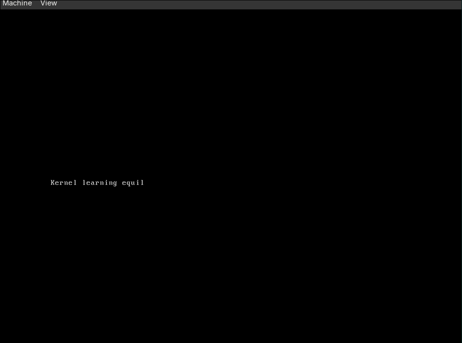

# Kernel Learning

A bare-metal x86 kernel written for learning purposes. Boots via Multiboot, sets up a stack, and writes text to VGA memory.

## Requirements

- `nasm`
- `gcc` (with 32-bit support)
- `ld` (binutils)

Using Nix:

```bash
nix-shell
```

## Build

```bash
make
```

## Manual Build Steps

```bash
# 1. Assemble the bootloader
nasm -f elf32 bootloader.asm -o kasm.o

# 2. Compile the kernel
gcc -m32 -c kernel.c -o kernel.o

# 3. Link
ld -m elf_i386 -T link.ld -o kernel kasm.o kernel.o
```

## Preview



## Run

```bash
qemu-system-i386 -kernel kernel
```

## Clean

```bash
make clean
```
